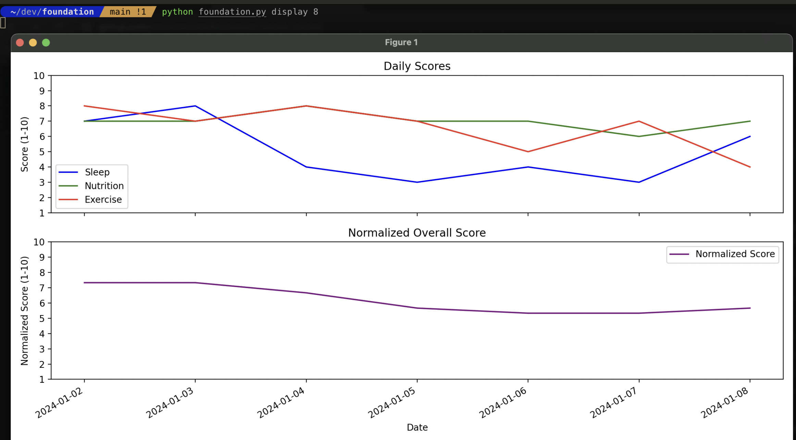

# Foundation Health Tracker

The Foundation Health Tracker is a simple yet powerful CLI tool designed to help users track and visualize key daily health metrics. This tool allows users to record their sleep, nutrition, and exercise scores, and then visualize this data over different time spans. FHT is a completely open source tool where you manage your data and can customize the CLI as desired.

## Features

- **Data Entry**: Easily add daily health metrics for sleep, nutrition, and exercise.
- **Data Visualization**: Visualize your health trends over the past week, month, or any custom number of days.
- **Data Review**: Review all entered data in a simple, readable format.

## Installation

1. Ensure you have Python installed on your machine. This tool is compatible with Python 3.x.

2. Clone the repository to your local machine:

```bash
git clone https://github.com/your-username/foundation-health-tracker.git
cd foundation-health-tracker
```

3. Install required dependencies (if any).

```bash
pip install -r requirements.txt
```

## Usage

#### Adding Daily Health Data
To add new health data for the current day:

```bash
python foundation.py update 6 8 7
```
Here, 6, 8, and 7 are example scores for Sleep, Nutrition, and Exercise.

To add health data for a specific date, include the optional date at the end in YYYY-MM-DD format:

```bash
python foundation.py update 6 8 7 2024-01-09
```

#### Visualizing Health Data

Example of plotted visual output:


The default view is 7 days

```bash
python foundation.py display
```

To display health data for a custom number of past days (e.g., 30 days):

```bash
python foundation.py display 30
```

#### Viewing Raw Data

For a quick view of your CSV health data use:

```bash
python foundation.py showdata
```

## Contributing

Contributions to the Foundation Health Tracker are welcome. Please ensure your pull requests are well-described.

1. Fork the Project
2. Create your Feature Branch (git checkout -b feature/AmazingFeature)
3. Commit your Changes (git commit -m 'Add some AmazingFeature')
4. Push to the Branch (git push origin feature/AmazingFeature)
5. Open a Pull Request

## License
Distributed under the MIT License. See LICENSE for more information.